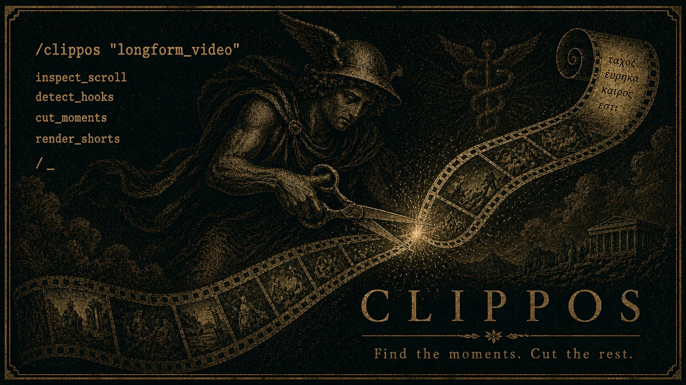

<p align="center">
  
</p>

<p align="center">
  <a href="LICENSE"></a>
  <a href="#hardware-requirements"></a>
  <a href="#install"></a>
</p>

# Clippos

> **Find the moments. Cut the rest.**

Turn any long-form video — local file, YouTube link, Discord/Telegram
attachment URL, or any URL [yt-dlp](https://github.com/yt-dlp/yt-dlp)
supports — into captioned, viral-ready social clips with a single
`/clippos` call in your agent. Ships as a skill for
[Hermes](https://hermes-agent.nousresearch.com), Claude Code, and Codex — and
runs in any harness that can execute a Python script and read JSON.

The engine does the hard media work locally (transcription, diarization, face
detection, optical-flow motion scoring, virtual-camera cropping, ASS caption
burn-in, multi-ratio render). The active agent's model handles the
*judgement* work (which clips are worth posting, titles, captions, hashtags)
via a JSON handoff — so the clipper never locks you into a specific
provider, inherits your agent's memory + preferences, and learns from your
keep/skip decisions over time.

Designed Hermes-first. Works anywhere.

## Why Hermes?

Clippos is built Hermes-first because Hermes is the natural home for
agent-native, local-first creator tools. The split lines up cleanly:

- **Hermes provides editorial judgment.** Per-clip scoring, brief
  authoring, packaging (titles, captions, hashtags), and "did the
  user post this?" feedback all happen via Hermes' active model — no
  vendor lock-in, no API key, your model your call.
- **Clippos provides the deterministic media engine.** Whisper
  large-v3 + SpeechBrain diarization + RetinaFace + RAFT optical
  flow + virtual-camera crop + ASS captions + multi-ratio render —
  all local, no upload, no third-party API.
- **The state lives where Hermes can see it.** Every stage writes a
  JSON artifact (transcript, vision, brief, scores, review,
  renders, packages, feedback) so Hermes can pause, inspect, resume,
  and learn across runs.
- **Self-improving creator profile.** Your kept/skipped feedback
  becomes `creator_patterns` attached to the next scoring handoff —
  Hermes' notion of persistent preference, applied per video.

The same skill also runs in Claude Code and Codex (via their native
plugin marketplaces) and in any harness that can shell out to a
Python script and read JSON. But the design center is Hermes.

## Install

> **Heads up:** first `/clippos` run downloads ~3.5 GB of model weights and
> the pipeline is compute-heavy. Read [Hardware requirements](#hardware-requirements)
> before installing — 16 GB RAM is the practical floor.

Each harness installs Clippos via its native install mechanism. No
top-level install script — the per-harness commands below are
canonical.

| Harness         | Install command                                                                                | Command surface                                          |
| --------------- | ---------------------------------------------------------------------------------------------- | -------------------------------------------------------- |
| **Hermes**      | `git clone https://github.com/dylan-buck/Clippos $HERMES_HOME/skills/clippos && bash …/bootstrap-venv.sh` | `/clippos`, `/clippos config`, `/clippos package`        |
| **Claude Code** | `/plugin marketplace add dylan-buck/Clippos`                                                   | `/clippos:clippos`, `/clippos:clippos-config`, `/clippos:clippos-package` |
| **Codex**       | `codex marketplace add dylan-buck/Clippos`                                                     | `/clippos`, `/clippos-config`, `/clippos-package`        |
| **Any harness** | Clone, run `bootstrap-venv.sh`, drive `scripts/hermes_clippos.py`                              | `hermes_clippos.py advance --source ...`                 |

All four paths resolve to the same `SKILL.md` and the same helper
scripts.

### Hermes (recommended)

Hermes is a self-contained workspace — no marketplace yet, but the
install + first-run flow is one paste:

```bash
HERMES_HOME="${HERMES_HOME:-$HOME/.hermes}"
git clone https://github.com/dylan-buck/Clippos "$HERMES_HOME/skills/clippos"
bash "$HERMES_HOME/skills/clippos/scripts/bootstrap-venv.sh"
```

The bootstrap script verifies Python 3.12, creates a `.venv` inside
the skill dir, pip-installs the engine extras (~5 min, ~700 MB of
wheels), and persists `CLIPPOS_ROOT` to `~/.config/clippos/.env`.
Resumable on partial failures — a half-installed `.venv` will pick
up where it left off the next time you run the script.

Start a fresh Hermes session and the `/clippos` skill registers
automatically. See [HERMES_SETUP.md](HERMES_SETUP.md) for
prerequisites, troubleshooting, update flow, and the gateway-syntax
notes for Discord / Telegram. Typical CLI usage:

```text
/clippos /absolute/path/video.mp4
/clippos https://www.youtube.com/watch?v=...
/clippos config --output-dir ~/Documents/Clippos
/clippos package
```

Attachment URLs dropped into Discord/Telegram are detected and
downloaded directly (yt-dlp is skipped for signed CDN URLs). Verify
the exact gateway syntax in your Hermes deployment before relying on
chat-native invocation in production.

### Claude Code

From inside Claude Code:

```text
/plugin marketplace add dylan-buck/Clippos
/plugin install clippos@Clippos
```

The marketplace registers the repo and Claude Code clones it into
`~/.claude/plugins/cache/Clippos/clippos/<sha>/`. The first
`/clippos:clippos` invocation auto-runs `scripts/bootstrap-venv.sh`
to create the `.venv` and pip-install the engine extras (~5 min,
~700 MB of wheels). Subsequent calls skip the bootstrap.

```text
/clippos:clippos /absolute/path/video.mp4
/clippos:clippos-config --output-dir ~/Documents/Clippos
/clippos:clippos-package
```

### Codex

From inside the Codex CLI:

```text
codex marketplace add dylan-buck/Clippos
```

Then enable the `clippos` plugin from the marketplace via the Codex TUI
(`/plugins`) or by adding to `~/.codex/config.toml`:

```toml
[plugins."clippos@Clippos"]
enabled = true
```

Codex clones the repo into `~/.codex/plugins/cache/Clippos/clippos/<sha>/`
and the same first-run bootstrap behavior applies. Slash commands are
identical to Claude Code (without the `clippos:` namespace prefix).

### Any other harness (generic)

If you're running a harness without a plugin marketplace (custom agent
framework, bare terminal, a provider SDK), clone manually and run the
same bootstrap script:

```bash
git clone https://github.com/dylan-buck/Clippos
bash Clippos/scripts/bootstrap-venv.sh
export CLIPPOS_ROOT="$(pwd)/Clippos"
```

Then drive the pipeline with `hermes_clippos.py` (the harness-agnostic
state-machine driver):

```bash
"$CLIPPOS_ROOT/.venv/bin/python" "$CLIPPOS_ROOT/scripts/hermes_clippos.py" \
  advance --source /absolute/path/video.mp4
```

The script prints structured JSON with a `next_action`: `brief`,
`score`, `package`, `done-renders`, `done-package`, `error`, or
`configure`. Your harness reads the JSON, writes the requested
response file when prompted, then calls `advance --workspace
"$WORKSPACE"` again to continue.

## Hardware requirements

The pipeline runs Whisper large-v3 transcription, RetinaFace face
detection, and RAFT optical flow locally — accurate but compute-heavy.
Calibrate before installing.

**Minimum (works, may be slow):**

- macOS Apple Silicon (M1+) with 16 GB unified memory, OR
- Linux x86_64 with 16 GB RAM (NVIDIA GPU strongly recommended)
- 10 GB free disk: ~3.5 GB model weights + ~2 GB vendored ffmpeg +
  workspace headroom

**Recommended:**

- Apple Silicon M2 Pro / M3 / M4 with 32 GB, OR NVIDIA RTX 30-series+
- 50 GB free disk if you plan to keep multiple workspaces

**Expected runtime on a 10-minute source video, M2 Pro 32 GB:**

- First run only: ~5 min model downloads (Whisper, SpeechBrain ECAPA,
  RetinaFace, RAFT — cached after that)
- Mining (transcribe + diarize + vision): 3–5 min
- Render: 1–2 min per ratio (so 3–6 min for the default 9:16 + 1:1 + 16:9)
- **Your fan will spin up.** Vision (RAFT optical flow on every sampled
  frame pair) is the loudest stage. This is normal.

**Scaling with duration:**

- 30-min video: ~10–15 min mining, ~3–6 min render per ratio
- 60-min video: ~25–40 min mining; 16 GB Macs may hit memory pressure
  during transcription — close Chrome and Slack first

**CPU-only machines (no GPU, no MPS):**

Everything still works, but expect 3–10× slower. A 10-min video may
take 30–45 min total.

Source videos are auto-capped to 1080p before transcription, so 4K @ 60 fps
inputs do not blow up memory — only duration scales peak RAM.

## Source formats

`/clippos <source>` accepts:

- **Local file paths** — `.mp4`, `.mov`, `.mkv`, `.webm`, `.m4v`, anything
  ffmpeg can decode. Drag-and-drop or attached files in chat-native
  harnesses (Hermes Discord/Telegram, Claude Code) resolve to local paths
  automatically.
- **YouTube URLs** — pasted directly as the source argument. Auto-capped
  at 1080p height to keep the WhisperX transcription stage from OOM-ing
  on 4K @ 60 fps streams.
- **Direct HTTPS video URLs** (signed S3, CloudFront, plain mp4 hosts) —
  downloaded with `urllib`, validated with ffprobe before mining.
- **Discord CDN attachments** (`cdn.discordapp.com`,
  `media.discordapp.net`) and **Telegram bot-file URLs**
  (`api.telegram.org`) — detected and downloaded directly via `urllib`
  (yt-dlp is skipped for those signed-URL cases since it cannot extract
  them).
- **Any other URL [yt-dlp](https://github.com/yt-dlp/yt-dlp/blob/master/supportedsites.md)
  supports** — Twitch VODs/clips, Vimeo, X/Twitter, Reddit hosted video,
  TikTok, Instagram, Facebook, and 1000+ more sites. **Untested** in
  Clippos beyond YouTube; should work since the download step is just
  `yt-dlp` with a 1080p height cap, but no platform-specific handling
  beyond Discord/Telegram. File a bug if your platform breaks.

Local files always work. URL-based sources require `yt-dlp` on PATH (it
ships in the engine extras for the marketplace install paths).

## Demo (5-minute flow)

Pick any known-good local video 5–10 minutes long.

1. **Install.** Pick the install command for your harness from the
   [Install matrix](#install) above. Claude Code and Codex install via
   their native marketplace (`/plugin marketplace add` and
   `codex marketplace add` respectively) and auto-bootstrap the venv
   on the first `/clippos` call. Hermes is a `git clone` + one bash
   script.
2. **Configure** (optional). In your agent, run `/clippos config --output-dir
   ~/Documents/Clippos` (Hermes) or `/clippos-config ...` (Claude Code /
   Codex). Writes the `.env`. **No HuggingFace token needed** —
   diarization uses the open-source SpeechBrain stack by default.
3. **Clip.** Run `/clippos ~/Downloads/sample-talk.mp4 --ratios 9:16,1:1`.
   The skill mines candidates locally, the agent first authors a video
   brief from the transcript (one model handoff), then scores each
   candidate, the skill auto-approves the top 5 + renders, and the
   agent reports back the workspace, clips directory, and MP4 paths.
4. **Package.** Run `/clippos package`. Produces per-clip `package.json`
   with titles, thumbnail overlay lines, social caption, hashtags, and
   opening-line hooks.
5. **Learn.** Tell the agent which clips you actually posted:
   `hermes_clippos.py feedback <workspace> --kept c1 --skipped c2 --note
   c2='too long'`. The next `/clippos` run will surface patterns in the
   scoring handoff.

## Configuration

Skill configuration lives at `~/.config/clippos/.env`. Write it
through the skill rather than hand-editing:

```bash
"$CLIPPOS_PYTHON" "$CLIPPOS_ROOT/scripts/clippos_skill.py" config-write \
  --output-dir "$HOME/Documents/Clippos" \
  --ratios "9:16,1:1,16:9" \
  --approve-top 5 \
  --min-score 0.70
```

Supported keys (all optional):

```env
CLIPPOS_OUTPUT_DIR=~/Documents/Clippos       # where MP4s land
CLIPPOS_RATIOS=9:16,1:1,16:9                 # default render set
CLIPPOS_MAX_CANDIDATES=12                    # mining cap per video
CLIPPOS_APPROVE_TOP=5                        # auto-approve top N scores
CLIPPOS_MIN_SCORE=0.70                       # threshold for top-N selection

# Optional. Default diarizer is open-source SpeechBrain (no token needed).
# Set CLIPPOS_DIARIZER=pyannote and HF_TOKEN to opt into the pyannote upgrade.
CLIPPOS_DIARIZER=speechbrain
HF_TOKEN=hf_...
```

Per-job knobs (passed at invocation, not persisted):

- `--ratios 9:16,1:1` — render only the listed ratios
- `--clips 3` — auto-approve the top N (overrides `CLIPPOS_APPROVE_TOP`)
- `--min-score 0.6` — lower the auto-approve threshold for this run
- `--max-candidates 8` — cap mining for this run

The skill renders all three ratios by default because rendering is
deterministic and does not use the agent's model. Narrow the set with
`--ratios` only when the user explicitly asks.

## Output locations

By default, all artifacts land under `~/Documents/Clippos/jobs/<job_id>/`.
Override with `--output-dir` at job time or set `CLIPPOS_OUTPUT_DIR` in
your config. The `<job_id>` is a SHA-1 of the source video path —
re-running on the same path reuses the same workspace and skips
already-cached stages.

Per-job workspace layout:

```text
~/Documents/Clippos/jobs/<job_id>/
├── transcript.json              # WhisperX output (cached)
├── vision.json                  # face / motion / scene-cut signals (cached)
├── brief-request.json           # ← engine writes; harness authors brief
├── brief-response.json          # ← harness writes
├── brief-cache.json             # last good brief, survives reruns
├── scoring-request.json         # ← engine writes; harness scores each clip
├── scoring-response.json        # ← harness writes
├── scoring-cache/<hash>.json    # per-clip score cache, keyed by brief context
├── review-manifest.json         # auto-approved candidates
├── render-report.json           # final summary with output paths
└── renders/<clip_id>/
    ├── <clip_id>-9x16.mp4       # final MP4s for each requested ratio
    ├── <clip_id>-1x1.mp4
    ├── <clip_id>-16x9.mp4
    ├── <clip_id>-*.ass          # ASS subtitle sidecars
    ├── render-manifest.json
    └── package.json             # /clippos-package output (titles, hashtags, etc.)
```

The MP4s are what you upload. The JSON files are the workspace's audit
trail — they let you re-run any stage without re-mining and they're how
the harness model picks up where it left off across `/clippos` invocations.

## What it does

One concrete example. You have a 45-minute podcast recording. In your agent:

```text
/clippos ~/Downloads/podcast.mp4 --ratios 9:16
```

The skill:

1. Transcribes locally with WhisperX large-v3, then diarizes with the
   zero-config SpeechBrain ECAPA + silero-VAD stack (no HF token).
2. Analyzes vision: scene cuts (PySceneDetect), face positions
   (RetinaFace-ResNet50), optical-flow motion (RAFT).
3. Mines 12 candidate 20–60s windows with strong hooks, payoffs, and
   spike signals (controversy, big-number, expert-endorsement, etc.),
   plus an explicit guarantee that detected multi-speaker / interview
   blocks each get at least one candidate even when their windows score
   below the regular floor.
4. Asks the agent's active model to author a one-paragraph **video brief**
   — theme, expected viral patterns, anti-patterns — from the full
   transcript. One model handoff per video; cached for the rest of the
   workspace's life.
5. Asks the model to score every candidate against a fixed rubric (hook,
   shareability, standalone clarity, payoff, delivery energy,
   quotability) plus the brief-derived bias and creator-profile cues
   from past runs.
6. Auto-approves at least the top 5 candidates when the video has enough
   valid windows, filling below the quality threshold only when needed
   to satisfy the minimum.
7. Virtual-camera-crops each approved clip to 9:16, burns ASS captions in
   the configured preset, renders an H.264/AAC mp4.
8. Returns the workspace path and mp4 paths to your agent.

Optionally follow up with `/clippos package` to generate title candidates,
thumbnail overlay lines, social captions, hashtags, and opening-line hooks
for every rendered clip.

## What makes it unique

- **Harness-agnostic.** The clipper never calls an LLM directly — it hands
  every semantic decision to whatever model your agent is running. Same
  engine, any provider.
- **Chat-native.** Drop a video in Hermes Discord or Telegram, get back
  finished mp4s in the same thread. Discord CDN and Telegram bot-file URLs
  are detected automatically.
- **Self-improving creator profile.** After each run, record which clips
  you posted vs. skipped (`/clippos feedback` or programmatically via
  `hermes_clippos.py feedback`). The skill aggregates patterns across runs
  (length bias, spike-category preference, ratio preference, score
  disagreement) with confidence tiers and surfaces them to the next
  scoring handoff. Rules can be promoted into the harness's memory.
- **Local-first, zero-config.** Transcription, diarization, vision, and
  rendering all run on your machine with no API keys, no HuggingFace
  token, and no license click-throughs. Default speaker diarization uses
  silero-VAD + SpeechBrain ECAPA-TDNN (Apache 2.0 / CC-BY-4.0, public
  weights). The pyannote 4.x upgrade stays available as an opt-in for
  users who already have an HF token.
- **Video-brief context.** Before per-clip scoring, the model reads the
  full transcript and authors an opinionated frame: theme, expected
  viral patterns, anti-patterns. Per-clip scoring then sees the global
  shape of the video — not just one clip in isolation. Cached per
  workspace so re-running scoring doesn't re-pay the brief cost.
- **Deterministic engine, judgement delegated.** The clipper validates
  every handoff against a strict JSON schema with `clip_id`/`clip_hash`
  integrity checks (the clip hash now folds in the brief context too,
  so brief edits invalidate the relevant cached scores), so model
  outputs can't silently corrupt a run.

## How it works

The pipeline is a state machine. Each stage writes a JSON artifact in
the workspace; deterministic stages run automatically, model-handoff
stages pause for a response file:

```text
/clippos video.mp4
    │
    ├─→ mine        → scoring-request.json + brief-request.json
    │                 (transcribes, diarizes, analyzes vision, mines candidates)
    ├─→ brief       (agent authors → brief-response.json)
    │                 ↳ engine embeds brief into scoring-request.json
    ├─→ score       (agent scores → scoring-response.json)
    ├─→ review      → review-manifest.json (auto-approves top N)
    ├─→ render      → render-report.json + renders/<clip>/<clip>-{9x16,1x1,16x9}.mp4
    │
    └─ /clippos package
        ├─→ package-prompt → package-request.json (with brief embedded)
        │                    (agent packages → package-response.json)
        └─→ package-save    → renders/<clip>/package.json
                              + package-report.json
```

The full skill flow, including creator-profile memory, the brief
handoff contract, and feedback loop, is in [SKILL.md](SKILL.md).

## Local dev setup

Requirements:

- Python 3.12 (TensorFlow wheels cap at 3.12; pyproject pins `<3.13`)
- FFmpeg and `ffprobe` on your `PATH`, OR engine extras installed
  (the vendored `static-ffmpeg` is auto-used as a fallback)

Install the project and dev tools:

```bash
python3.12 -m venv .venv
source .venv/bin/activate
pip install -e ".[dev]"
```

To run the real transcription + diarization pipeline, also install the
engine extras:

```bash
pip install -e ".[engine,dev]"
```

Or, with `uv` (catches resolver-strict pin issues that pip silently
ignores — recommended for fresh installs):

```bash
uv sync --extra engine --extra dev
```

Run the checks used in local development:

```bash
ruff check .
.venv/bin/pytest -v
```

Run the gated real-video E2E check when you want to validate the
production path on an actual file:

```bash
export CLIPPOS_E2E_VIDEO=/absolute/path/to/5-10-minute-video.mp4
.venv/bin/pytest -m e2e -v
```

## CLI Flow (advanced)

For non-harness use, drive the pipeline directly with the CLI:

- `python -m clippos.cli version`
- `python -m clippos.cli run /absolute/path/job.json [--stage mine|brief|review|render|auto]`

`run` reads a job file, validates it against the shared `ClipposJob`
contract, and executes the requested pipeline stage. `--stage` defaults
to `auto`.

Minimal job file:

```json
{
  "video_path": "/absolute/path/input.mp4",
  "output_dir": "/absolute/path/output"
}
```

### Stages

- `mine` — ingest + transcribe + vision + mining, then writes
  `scoring-request.json` (and `brief-request.json` if `video_brief` is
  enabled in the job's `output_profile`).
- `brief` — re-writes `scoring-request.json` with the resolved video
  brief embedded. Requires `brief-response.json` (or a cached brief).
- `review` — consumes an existing `scoring-request.json` plus a matching
  `scoring-response.json` (or cached scores) and writes
  `review-manifest.json`.
- `render` — consumes `review-manifest.json`, builds per-clip
  `RenderManifest` plans for candidates marked `"approved": true`, and
  shells out to FFmpeg to produce the configured ratios + ASS caption
  sidecars. Emits `render-report.json`; exits with an error when no
  candidates are approved.
- `auto` — runs `mine`, then `brief` (when enabled and the response is
  available), then `review`. **Does not chain into render** — that
  must be invoked explicitly. The Hermes `/clippos` flow handles
  approve + render automatically; the raw CLI stops at review by
  design.

See [docs/architecture/scoring-handoff.md](docs/architecture/scoring-handoff.md)
for the full rubric, schema, and caching rules.

## Current v1 limitations

- **`--stage auto` does not chain into render.** The CLI's `auto` stage
  runs mine → brief → score → review and stops; render must be invoked
  explicitly. The Hermes `/clippos` flow auto-approves + renders past
  review automatically, but raw-CLI users need an extra step.
- **Auto-approval is the default in the agent flow.** The `/clippos` skill
  auto-approves the top N scoring candidates above `min_score`, with
  backfill from below-threshold windows when fewer than N qualify.
  There's no required human-review pause in the agent loop. To gate on
  manual review, drive the raw CLI directly: `--stage review`, edit
  `review-manifest.json` to flip `"approved": true` on the candidates
  you want, then `--stage render`.
- **Linux and Windows install paths are not dogfood-verified.** The
  pin set is resolver-clean on macOS arm64 (verified under both pip
  and `uv sync`) but the engine extras + `bootstrap-venv.sh` have not
  been cold-installed on Linux x86_64 or Windows. Both should work —
  TF and torch wheels exist for both — but verification is pending.
  See [docs/pre-ship-fixes.md](docs/pre-ship-fixes.md).
- **NVIDIA / CUDA wheels require manual install on Linux.**
  `bootstrap-venv.sh` pulls the CPU `torch==2.8.0` wheel by default.
  Linux users with NVIDIA GPUs need to install the CUDA-suffixed wheel
  manually after bootstrap completes (e.g. `pip install
  torch==2.8.0+cu124 --index-url
  https://download.pytorch.org/whl/cu124`). The script does not
  auto-detect CUDA.
- **Mining heuristics are English-tuned.** Both monologue keyword
  buckets (controversy, taboo, etc.) and interview keyword buckets
  ("hands down", "I'm long", etc.) are English-only. WhisperX
  large-v3 transcribes other languages, but the candidate miner will
  surface poor windows for non-English content. The harness model's
  brief + scoring can partially compensate, but the heuristics
  themselves are English-first.
- **Job IDs are path-hashed, single source per workspace.** A workspace
  is identified by SHA-1 of the source video path. Re-running on the
  same path reuses the same workspace (good for resume). If you edit
  the source video at the same path, manually delete the workspace
  under `<output_dir>/jobs/<job_id>/` to force a fresh mine. There's
  no batch mode — invoke `/clippos` (or `hermes_clippos.py advance --source
  ...`) in a loop for multiple videos.
- **Brief stage adds one model handoff per video.** Disable via
  `output_profile.video_brief: false` in the job for the legacy
  single-handoff flow. The brief is cached per workspace, so the cost
  is paid once per video, not once per scoring run.
